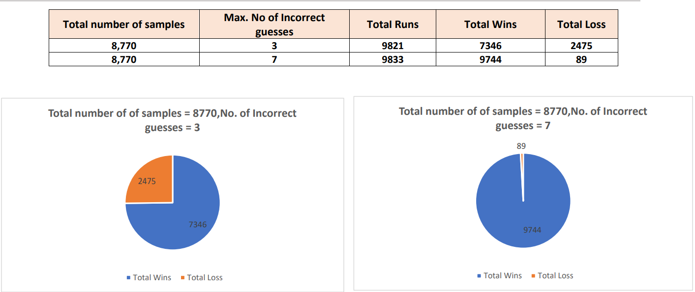

# Solving Hangman

### Experimental Results

### Basic Strategy

1. Find the length of the word to be guessed and create a sample set by filtering out all the words of matching length from the
   provided dictionary.
   

2. Compute the frequency count of each individual unique characters from all the words in the sample set.
   Once the frequency counts are computed, we pick the letter with the highest frequency value and make a guess with that
   letter. After this guessing, there are two possible cases,
   
   **Case 1:** If it is a right guess(Hit), our sample set is reduced by filtering only the words that contains guessed character
   in the identified position. So, when the guessed character appears more than once in the word, then there is
   chance of getting greatly reduced sample set.
   
   **Case 2:** If it is a wrong guess(Miss), we reduce our sample set to have only the words that does not contain the
   guessed character.

   
4. The frequency count of all the unique characters in the reduced sample set is recomputed(excluding already guessed letter)
   and then make a guess with the character that has highest frequency count. If two characters has same frequency value,
   then we pick the latter because we identified that this increasing winning chances (from our experimental analysis).

   
5. The same process repeats until the word is correctly guessed or the maximum number of incorrect guess limit is reached.

### Implemented Approach/Strategy:

1. Create sample sets for each word in the sentence or phrase by filtering out the words of length matching the length of word
   to be guessed.
   

2. Identify and select the longest word from the given sentence or phrase and start making guesses to that word.
   

3. To make guesses, we follow the same method as in Dictionary-aware strategy and Two-word hangman variant, i.e. by
   computing the characters frequency count and making guess with the character having highest frequency value.
   

4. Then based on either “Miss” or “Hit” sample set of the word being guessed and all the other words as well are reduced
   accordingly.
   

5. Whenever a guess is made , the sample set of each unsolved word in the sentence is validated to check if it has reached the
   size of 1 (which means that word is completely found as there will be only one word left in sample set, so every guess will be
   a hit).
   

6. If the sample set size is reduced to 1 for any word in the sentence , then our algorithm switches to that word and start
   making guesses(the unguessed characters from the word left in its sample set) to “Hit” that word completely.
   

7. Simultaneously, the sample sets of other words are also reduced whenever a guess is made(based on if that contains the
   guessed character or not).
   

8. So, in making every guess, our strategy greatly reduces the sample sets very efficiently, so the probability of finding the word
   to be guessed with considerably minimum number of guess is increased.
   

9. Once a word is completely guessed, we switch back to next longest word from the unsolved words and follow the same
   strategy for the other words in the sentence.
   

10. This process happen until the sentence is completely found or the maximum number of incorrect guess limit is reached.
